<div align="center">

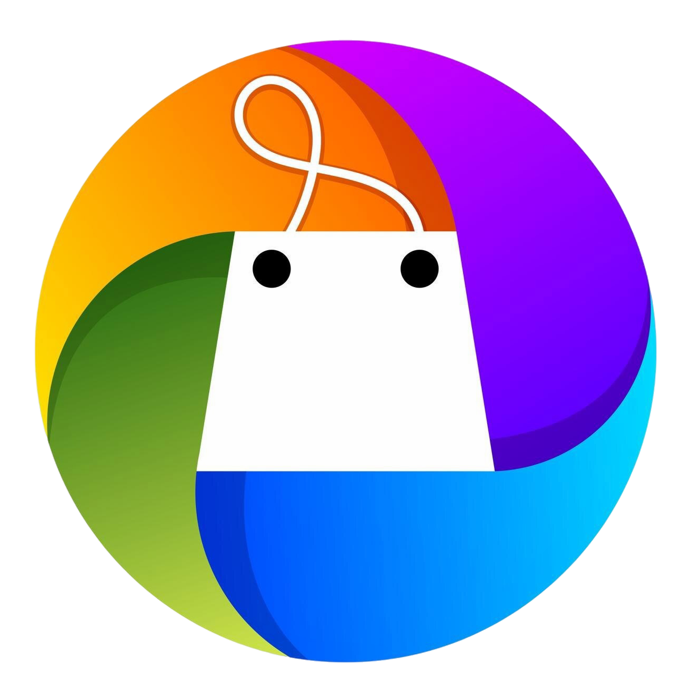

# Full-Stack eCommerce Website in Laravel 12
### A Modern Full-Stack E-Commerce Platform Built with Laravel 12

[](LICENSE)
[](https://laravel.com)
[](https://livewire.laravel.com)
[](https://www.php.net)
[](https://tailwindcss.com)
[](https://getbootstrap.com)

<p align="center">
  <a href="https://laravel.com" target="_blank">
    
  </a>
</p>

<a href="https://github.com/laravel/framework/actions"></a>
<a href="https://packagist.org/packages/laravel/framework"></a>
<a href="https://packagist.org/packages/laravel/framework"></a>
<a href="https://packagist.org/packages/laravel/framework"></a>

</div>

---

## 📌 About The Project

This Project is a modern e-commerce web application built with **Laravel 12**, **Livewire**, **Tailwind CSS**, and **MySQL**. It features a clean, responsive UI with role-based access control, a session-based shopping cart, dynamic product listings, and a glassmorphism-styled authentication system — all without any paid UI kits or third-party e-commerce packages.

> Built from scratch as a real-world Laravel project — every feature is handcrafted!

---

## 📷 Screenshots

### Guest Homepage
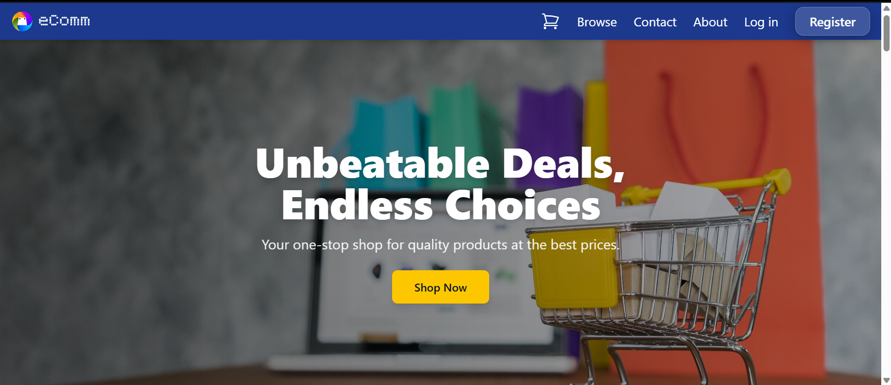

### User Homepage


### Admin Homepage
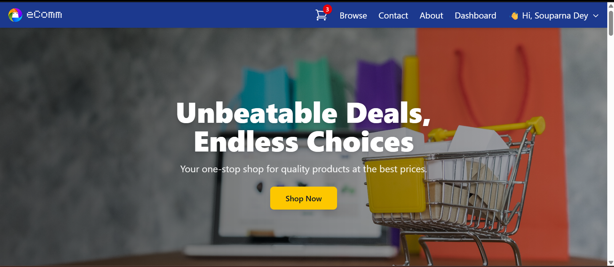

### Login Page
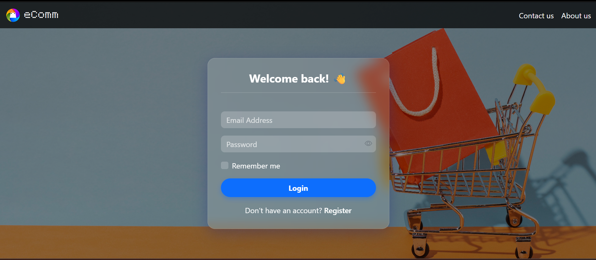

### Registration Page
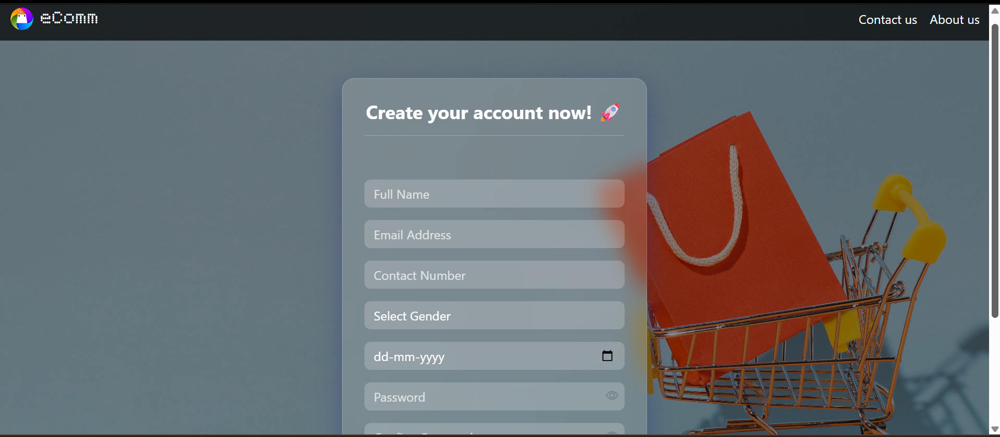

### Banners & Product Advertising
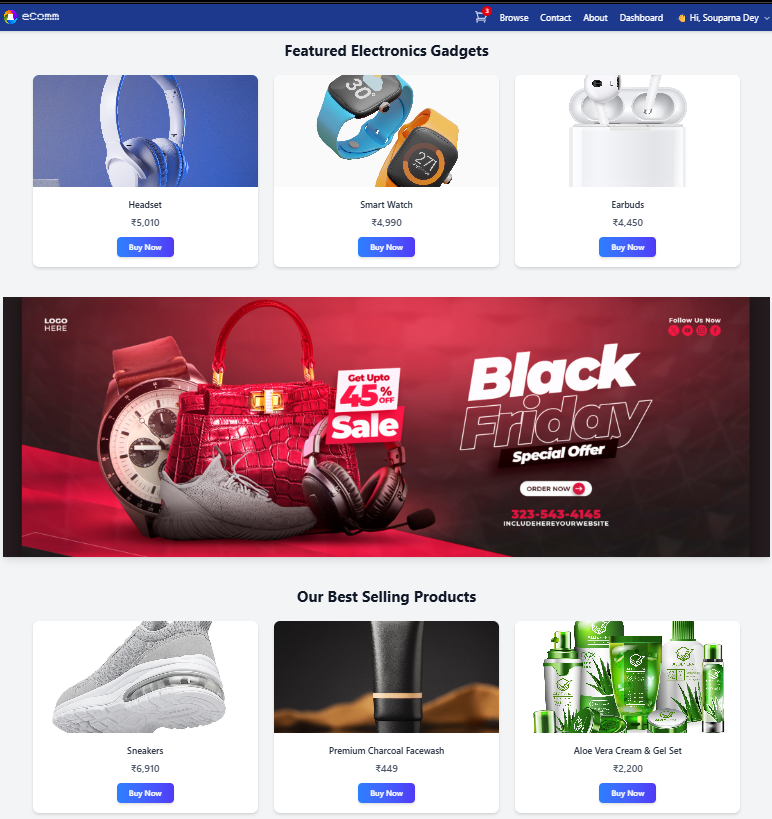

### Homepage Footer
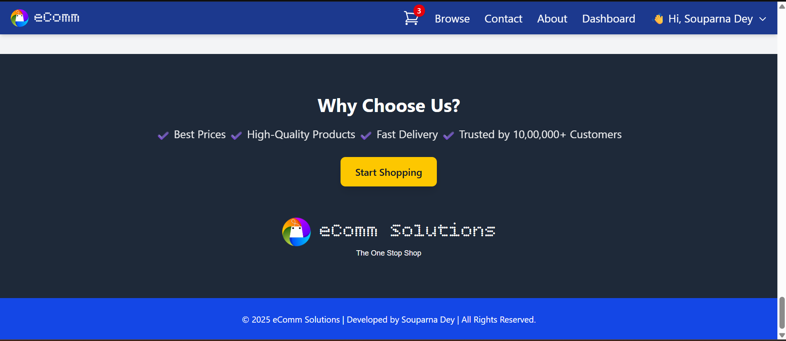

### Products Page
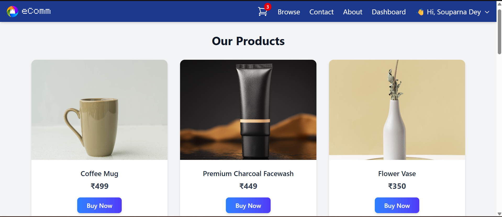

### Cart Page
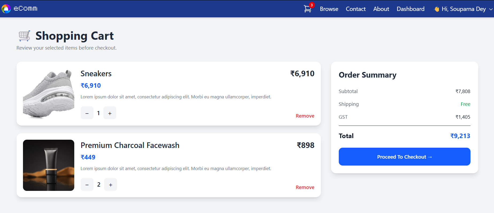

### Profile Page
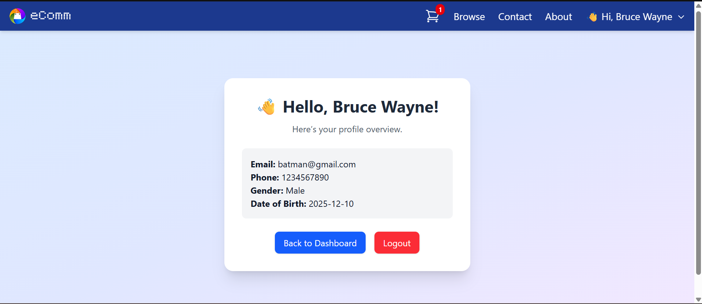

### Contact Us
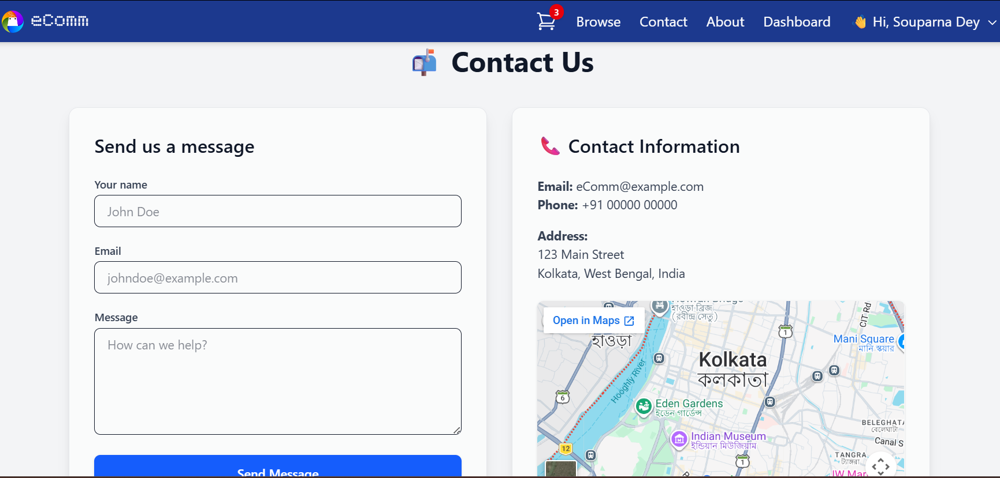

### About Us
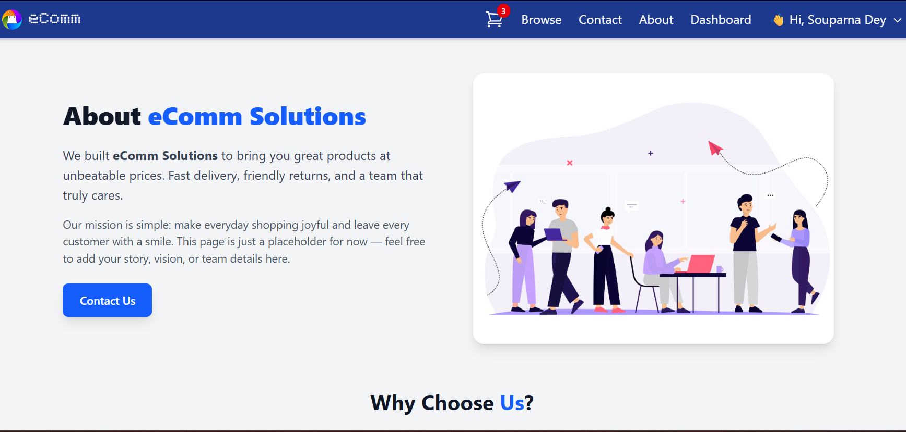

### Admin Dashboard
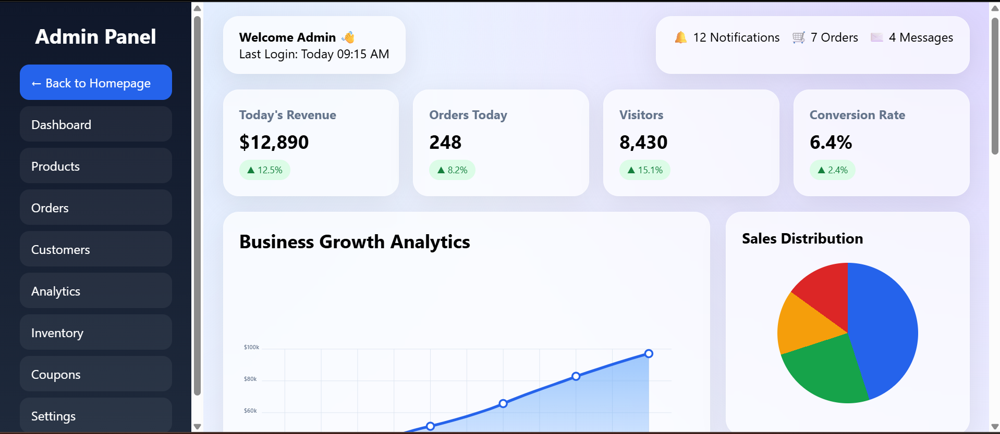

---

## ✨ Features

### 🛍️ Product System
- Dynamic product listing fetched live from MySQL database
- Product detail page with multi-image gallery
- Clickable thumbnail gallery — swap main image on click
- Real-time stock availability badge:
  - 🔴 **Out Of Stock** — stock = 0
  - 🔴 **Hurry!! Only One Left** — stock = 1
  - 🔴 **Very Few Left!!** — stock = 2–5
  - ✅ **In Stock** — stock > 5
- Add to Cart button auto-disabled when out of stock

### 🛒 Shopping Cart
- Session-based cart (no login required)
- Add, increase, decrease, and remove items
- Dynamic cart badge in navbar (hidden when empty)
- Order summary with subtotal, 18% GST, and total
- Friendly empty cart state with Browse CTA

### 🏠 Home Page
- Hero banner with CTA
- Sale announcement banners and video section
- Various featured products section
- Clickable sale banner
- "Why Choose Us" section
- Brand footer with logo

### 🔐 Authentication
- Livewire-powered Login & Registration forms
- Role-based redirect after login
- Registration success page

### 🛡️ Admin Panel
- Protected admin dashboard (custom `AdminMiddleware`)
- Admin-only navbar link (hidden via role check)
- Non-admins redirected with access denied message

### 🧭 Navigation
- Fixed top navbar with brand logo + custom Google Font
- Dynamic cart count badge
- Hover dropdown for logged-in users (Profile & Logout)
- Guest links: Log in, Register
- Admin-only Dashboard link

### 🎨 UI & Design
- Tailwind CSS throughout; Bootstrap 5 for auth pages
- Custom Google Font for brand logo
- Products-cards & Gradient buttons with hover transition effects
- Responsive product grid (1 → 2 → 3 columns)

---

## 🧰 Tech Stack

| Layer | Technology |
|---|---|
| Backend | Laravel 12 (PHP 8.2+) |
| Frontend | Blade, Tailwind CSS, Bootstrap 5 |
| Reactive UI | Laravel Livewire 3 |
| Database | MySQL (via XAMPP) |
| Auth | Laravel Auth + Livewire |
| Sessions | Database driver |
| Assets | Vite |
| Icons | Bootstrap Icons |
| Fonts | Google Fonts |

---

## 📁 Project Structure

    app/
    ├── Http/
    │   ├── Controllers/
    │   │   ├── ProductController.php
    │   │   └── CartController.php
    │   └── Middleware/
    │       └── AdminMiddleware.php
    ├── Livewire/
    │   ├── LoginForm.php
    │   └── RegisterForm.php
    └── Models/
    ├── Product.php
    └── Cart.php
    resources/views/
    ├── components/
    │   ├── layouts/
    │   │   ├── app.blade.php
    │   │   └── auth.blade.php
    │   ├── product-card.blade.php
    │   └── hero.blade.php
    ├── livewire/
    │   ├── login-form.blade.php
    │   └── register-form.blade.php
    ├── welcome.blade.php
    ├── products.blade.php
    ├── product-detail.blade.php
    ├── cart.blade.php
    ├── profile.blade.php
    ├── contact.blade.php
    ├── about.blade.php
    └── admin/
    └── dashboard.blade.php

---

## ⚙️ Installation Guide

### Step 1: Clone the Repository
```sh
git clone https://github.com/souparnadey/Full-stack-eCommerce-Website-in-Laravel-12
cd Full-stack-eCommerce-Website-in-Laravel-12
```

### Step 2: Install Dependencies
```sh
composer install
npm install
```

### Step 3: Environment Setup
```sh
cp .env.example .env
php artisan key:generate
```
Update `.env` with your database credentials:
```env
DB_DATABASE=ecom_db
DB_USERNAME=root
DB_PASSWORD=
```

### Step 4: Database Setup
```sh
php artisan migrate --seed
```
> If migration fails, manually import `database/ecom_db.sql` via phpMyAdmin.

### Step 5: Storage Link
```sh
php artisan storage:link
```

### Step 6: Run the App
```sh
npm run dev
php artisan serve
```
Open [http://127.0.0.1:8000] (http://127.0.0.1:8000)

---

## 🔑 Demo Credentials

> ⚠️ For demo/testing only. Change immediately in production.

| Role | Email | Password |
|---|---|---|
| Admin | admin@gmail.com | 12345 |
| User | batman@gmail.com | 91939 |
| User | putin@gmail.com | putin |

---

## 🔮 Planned Features

- [ ] Checkout page with order placement
- [ ] Admin product CRUD (add, edit, delete)
- [ ] Products management in admin panel
- [ ] Order management in admin panel
- [ ] Wishlist functionality
- [ ] Order history for users
- [ ] Product search and category filter
- [ ] Payment gateway integration (Razorpay / Stripe)
- [ ] Product reviews and ratings

---

## 📩 Contact Me
💼 Need a **Full Stack Laravel Developer**? Let's work together! ☺️

- 📧 **Email:** deysouparna03@gmail.com   

🔗 **[Hire Me on Linkedin](https://linkedin.com/in/souparna-dey-69a701285/)**

---

## 📜 License

This project is **[MIT Licensed](LICENSE)** — free to use and modify!

---

⭐ **If you found this project helpful, please give it a star!** ⭐

**Thank you ☺️**

---
> Also Checkout my Complete & More Advanced [eCommerce Web Application Platform.](https://github.com/souparnadey/Complete-eCommerce-Web-Application-in-Laravel)


> Find me on:  [GitHub](https://github.com/souparnadey/) &nbsp;&middot;&nbsp; [LinkedIn](https://linkedin.com/in/souparna-dey-69a701285/) &nbsp;&middot;&nbsp; [Instagram](https://instagram.com/i_am_souparna/) &nbsp;&middot;&nbsp; 
